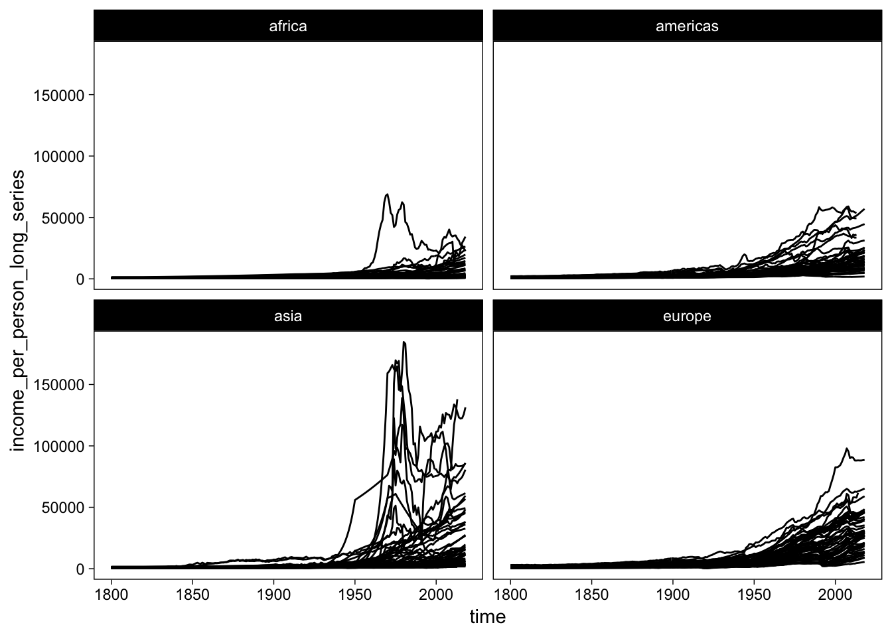

<!-- README.md is generated from README.Rmd. Please edit that file -->

# systemaGlobalis

systemaGlobalis is an R package that provides quick access to the
complete [Gapminder data
repository](https://github.com/open-numbers/ddf--gapminder--systema_globalis).

## Installation

You can install the development version of systemaGlobalis from
[GitHub](https://CRAN.R-project.org) with:

``` r
devtools::install_github("mvuorre/systemaGlobalis")
```

It is not currently available on CRAN (nor is it likely to be in the
near future.)

## Description

systemaGlobalis is a minimal R package interface to the complete
[Systema
Globalis](https://github.com/open-numbers/ddf--gapminder--systema_globalis#systema-globalis-sg)
data compilation gathered by Gapminder.

``` r
library(systemaGlobalis)
library(tidyverse)
theme_set(theme_linedraw() + theme(panel.grid = element_blank()))
```

It containts the following data frames (tibbles):

  - `datapoints`
      - For each country and year, 532 variables
      - The main data frame you’ll want to work with.

<!-- end list -->

``` r
dim(datapoints)
#> [1] 79290   534
datapoints[1:5, 1:5]  # First five rows and columns
#> # A tibble: 5 x 5
#>   geo    time adults_with_hiv_per… age_at_1st_marria… aged_15_24_employme…
#>   <chr> <int>                <dbl>              <dbl>                <dbl>
#> 1 abkh   2004                   NA                 NA                   NA
#> 2 abkh   2005                   NA                 NA                   NA
#> 3 abkh   2006                   NA                 NA                   NA
#> 4 abkh   2007                   NA                 NA                   NA
#> 5 abw    1700                   NA                 NA                   NA
```

  - `countries`
      - Additional information, such as naming schemes, regions, etc.,
        about the countries included in `datapoints`

<!-- end list -->

``` r
countries
#> # A tibble: 273 x 33
#>    country alt_5 alternative_1 alternative_2 alternative_3 alternative_4_c…
#>    <chr>   <chr> <chr>         <chr>         <chr>         <chr>           
#>  1 abkh    <NA>  <NA>          <NA>          <NA>          <NA>            
#>  2 abw     <NA>  <NA>          <NA>          <NA>          Aruba           
#>  3 afg     <NA>  Islamic Repu… <NA>          <NA>          Afghanistan     
#>  4 ago     <NA>  <NA>          <NA>          <NA>          Angola          
#>  5 aia     <NA>  <NA>          <NA>          <NA>          <NA>            
#>  6 akr_a_… <NA>  <NA>          <NA>          <NA>          <NA>            
#>  7 ala     <NA>  √Öland        <NA>          <NA>          <NA>            
#>  8 alb     <NA>  <NA>          <NA>          <NA>          Albania         
#>  9 and     <NA>  <NA>          <NA>          <NA>          <NA>            
#> 10 ant     <NA>  Neth. Antill… <NA>          <NA>          Netherland Anti…
#> # ... with 263 more rows, and 27 more variables: arb1 <chr>, arb2 <chr>,
#> #   arb3 <chr>, arb4 <chr>, arb5 <chr>, arb6 <chr>,
#> #   g77_and_oecd_countries <chr>, gapminder_list <chr>, god_id <chr>,
#> #   gwid <chr>, income_groups <chr>, `is--country` <lgl>,
#> #   iso3166_1_alpha2 <chr>, iso3166_1_alpha3 <chr>,
#> #   iso3166_1_numeric <int>, iso3166_2 <chr>, landlocked <chr>,
#> #   latitude <dbl>, longitude <dbl>, main_religion_2008 <chr>, name <chr>,
#> #   pandg <chr>, un_state <lgl>, unicode_region_subtag <chr>,
#> #   upper_case_name <chr>, world_4region <chr>, world_6region <chr>
```

  - `concepts`
      - Descriptions of each of the variables in `datapoints`, including
        sources, tags, etc.

<!-- end list -->

``` r
concepts
#> # A tibble: 534 x 8
#>    concept description indicator_url name  name_catalog name_short
#>    <chr>   <chr>       <chr>         <chr> <chr>        <chr>     
#>  1 adults… The estima… <NA>          Adul… Adults with… Adults wi…
#>  2 age_at… The mean a… <NA>          Age … Age at 1st … Age at 1s…
#>  3 aged_1… Percentage… <NA>          Aged… Aged 15-24   Employmen…
#>  4 aged_1… Percentage… <NA>          Aged… Aged 15-24   Unemploym…
#>  5 aged_1… For age gr… <NA>          Aged… Aged 15-64   Labour fo…
#>  6 aged_1… Percentage… <NA>          Aged… Aged 15+     Employmen…
#>  7 aged_1… For age gr… <NA>          Aged… Aged 15+     Labour fo…
#>  8 aged_1… Percentage… <NA>          Aged… Aged 15+     Unemploym…
#>  9 aged_2… For age gr… <NA>          Aged… Aged 25-54   Labour fo…
#> 10 aged_2… Percentage… <NA>          Aged… Aged 25-54   Unemploym…
#> # ... with 524 more rows, and 2 more variables: source_url <chr>,
#> #   tags <chr>
```

That’s it. There are no functions, simply clean datasets that are easily
used in analyses.

## Examples

Let’s first look at a selection of variables containing the word
“income”:

``` r
datapoints %>% 
  select(contains("income")) %>% 
  names(.)
#>  [1] "data_quality_income_per_person"                                    
#>  [2] "debt_servicing_costs_percent_of_exports_and_net_income_from_abroad"
#>  [3] "income_mountains"                                                  
#>  [4] "income_per_person_gdppercapita_ppp_inflation_adjusted"             
#>  [5] "income_per_person_long_series"                                     
#>  [6] "income_per_person_with_projections"                                
#>  [7] "income_share_of_2nd_poorest_20percent"                             
#>  [8] "income_share_of_2nd_richest_20percent"                             
#>  [9] "income_share_of_middle_20percent"                                  
#> [10] "income_share_of_poorest_10percent"                                 
#> [11] "income_share_of_poorest_20percent"                                 
#> [12] "income_share_of_richest_10percent"                                 
#> [13] "income_share_of_richest_20percent"                                 
#> [14] "subsistence_incomes_per_person"
```

``` r
datapoints %>% 
  ggplot(aes(time, income_per_person_long_series)) +
  geom_line(aes(group = geo)) +
  scale_x_continuous(limits = c(1900, 2018))
```


To find out more about this particular variable, look at the `concepts`
data frame

``` r
concepts %>% 
  filter(str_detect(concept, "income")) %>%
  select(1:2) %>% 
  slice(1:4) %>% 
  kable()
```

| concept                                                                      | description                                                                                                                                                                                                                                                                                     |
| :--------------------------------------------------------------------------- | :---------------------------------------------------------------------------------------------------------------------------------------------------------------------------------------------------------------------------------------------------------------------------------------------- |
| data\_quality\_income\_per\_person                                           | Rates the quality for each observation of “Income per person - revised”. The ratings are 0 (data quality not known yet) and 5 (very bad). You can use this “indicator” as color together with income per person to highlight the roughest observations.                                         |
| debt\_servicing\_costs\_percent\_of\_exports\_and\_net\_income\_from\_abroad | Total debt service to exports of goods, services and primary income. Total debt service is the sum of principal repayments and interest actually paid in currency, goods, or services on long-term debt, interest paid on short-term debt, and repayments (repurchases and charges) to the IMF. |
| income\_per\_person\_gdppercapita\_ppp\_inflation\_adjusted                  | Gross domestic product per person adjusted for differences in purchasing power (in international dollars, fixed 2011 prices, PPP based on 2011 ICP).                                                                                                                                            |
| income\_per\_person\_long\_series                                            | Income per person, version 15, including historical data & projections                                                                                                                                                                                                                          |

We can use the `countries` data frame to get more information about the
countries

``` r
datapoints %>% 
  left_join(rename(countries, geo = country)) %>% 
  filter(!is.na(world_4region)) %>% 
  ggplot(aes(time, income_per_person_long_series)) +
  geom_line(aes(group = geo)) +
  scale_x_continuous(limits = c(1800, 2018)) +
  facet_wrap("world_4region")
#> Joining, by = "geo"
```



And, of course, animations\! Here’s an animated version of the figure on
page 26 of Factfulness:

``` r
library(gganimate)
p <- datapoints %>% 
  select(geo, 
         time, 
         child = children_per_woman_total_fertility,
         mortality = child_mortality_0_5_year_olds_dying_per_1000_born, 
         pop = population_total) %>% 
  filter(between(time, 1945, 2018)) %>%
  ggplot(aes(child, (1000-mortality)/1000, size = pop)) +
  annotate(geom="rect", fill = NA, col = "gray40", 
           xmin = 8.5, xmax = 5, ymin = .55, ymax = .95) +
  annotate(geom="rect", fill = NA, col = "gray40", 
           xmin = 3.5, xmax = 1.1, ymin = .90, ymax = 1) +
  geom_point(shape = 21, fill = "gray40", alpha = .8) +
  scale_y_continuous("Children surviving to age 5",
                     breaks = 5:10/10,
                     limits = c(.5, 1),
                     labels = scales::percent) +
  scale_x_reverse("Babies per woman",
                  breaks = 1:8) +
  annotate(geom="text", col = "gray40", 
           x = 8.5, y = .55, vjust = 1, hjust = 0,
           label = "Big families and many children die") +
    annotate(geom="text", col = "gray40", 
           x = 3.5, y = .9, vjust = 1, hjust = 0,
           label = "Small families and\nfew children die") +
  theme(legend.position = "none") +
  labs(title = "Year: {frame_time}") +
  # Animation
  transition_time(time)
animate(p, nframes = 100)
```


# Acknowledgements

systemaGlobalis is simply a minimal R package wrapper to the dataset
created by Gapminder. As such, please refer to
<https://www.gapminder.org/> for more information about the data,
including sources, and please acknowledge them for any reuse of the
data.

> Gapminder created this dataset and provides it under Creative Common
> Attribution 4.0 International.

The R package is therefore distributed under the same license.

There is another gapminder R package that contains a selection of the
gapminder data, [gapminder](https://github.com/jennybc/gapminder), which
inspired this package.
